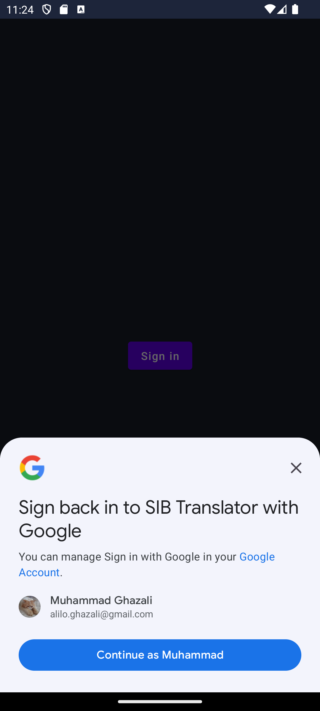
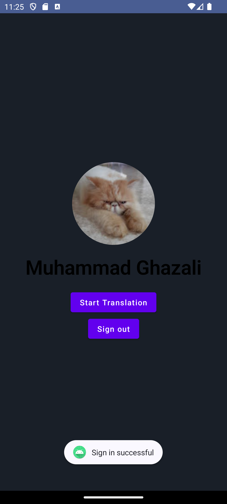
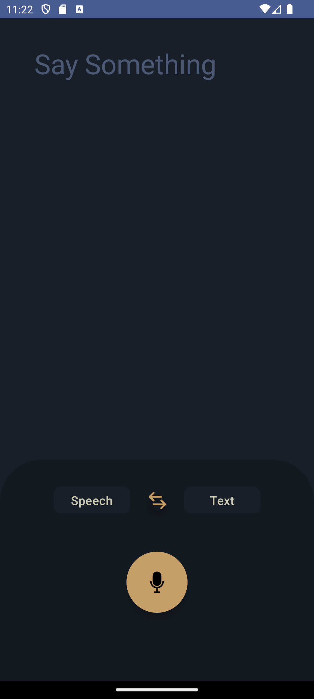

# SIBI Translator

## Deskripsi Aplikasi

Sibi Translator adalah aplikasi revolusioner yang memanfaatkan teknologi sarung tangan khusus ("glove") untuk membantu orang bisu berkomunikasi secara lebih efektif melalui bahasa isyarat. Aplikasi ini menawarkan solusi terdepan dengan menggabungkan pengenalan bahasa isyarat melalui sensor pada sarung tangan dan kecerdasan buatan (AI) untuk menerjemahkan bahasa isyarat menjadi teks yang dapat dibaca dan diucapkan.

## Tech

System Entity | Tech
--- | --- 
Mobile | Kotlin Jetpack Compose
Backend | Golang 
Google Text To Speech | TTS
Scikit Learn | ML
Vertex AI | AI Pipelining
BigQuery | Data Warehouse

## Screenshot Tampilan Aplikasi

### Login

### Home

### Translator

